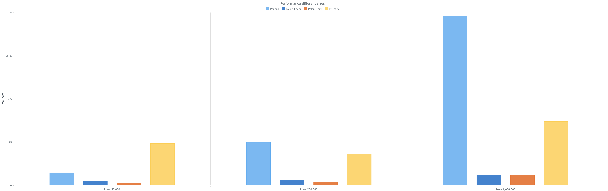
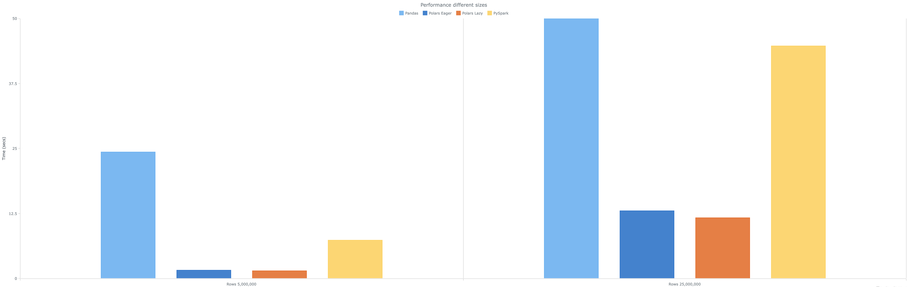

# Comparing Pandas, Polars, and PySpark: A Benchmark Analysis

Lately, I have been working with **Polars** and **PySpark**, which brings me back to the days when **Spark** fever was at its peak, and every data processing solution seemed to revolve around it. This prompts me to question: was it really necessary? 

Let’s delve into my experiences with various data processing technologies.

During my final degree project on sentiment analysis, **Pandas** was just beginning to emerge as the primary tool for feature engineering. It was user-friendly and seamlessly integrated with several machine learning libraries, such as scikit-learn.

Then, as I started working, **Spark** became a part of my daily routine. I used it for ETL processes in a nascent data lake to implement business logic. Although it wondered if we were over-engineering the process. Typically, the data volumes we handled were not substantial enough to necessitate using **Spark**, yet it was employed every time new data entered the system. We would set up a cluster and proceed with processing using Spark. In only a few instances did I genuinely feel that Spark was the right tool for the job.

This experience pushed me to develop a lightweight ingestion framework using **Pandas**. However, this framework did not perform as expected, struggling with medium to large files.

Recently, I've started using **Polars** for some tasks and I have been impressed by its performance in processing datasets with several million rows. This has led to me setting up a different benchmarking for all of these tools.

Let's dive into it!

## Little bit of context

### Pandas


We don't have to forget that **Pandas** has been the dominant tool for data manipulation, exploration, and analysis. **Pandas** rise in popularity among Data Scientists thanks to their similarities with R grid view. Moreover, it is synchronized with other Python libraries related to the machine learning field:
  -  **Numpy** is a mathematical library for implementing linear algebra and standard calculations. **Pandas** is based on **Numpy**.
  -  **Scikit-learn** is the reference library for machine learning applications. Normally, all the data used for the model has been loaded, visualized, and analyzed with **Pandas** or **Numpy**.

### PySpark


**Spark** is a free and distributed platform that transforms the paradigm of how big data processing is done, with **PySpark** as its Python library. It offers a unified computing engine with exceptional features:

- **In-Memory Processing**: Spark's major feature is its in-memory architecture, which is fast as it keeps the data in memory rather than on disk.
- **Fault Tolerance**: The failure tolerance mechanisms that are built into the software ensure dependable data processing. **Resilient Distributed Datasets** do data tracking and allow for automatic recovery in case of failures such as failures.
- **Scalability**: Spark’s horizontally scalable architecture processes large datasets adaptively and distributes much faster to clusters. The data is distributed, using the massive power of all nodes in the cluster.

### Polars


**Polars** is a Python library built on top of **Rust**, combining the flexibility and user-friendliness of Python with the speed and scalability of **Rust**.

**Rust** is a low-level language that prioritizes performance, reliability, and productivity. It is memory efficient and gives performance par with C and C++.

On the other hand, **Polars** uses **Apache Arrow** as its query engine to execute vectorized queries. **Apache Arrow** is a cross-language development platform for fast in-memory processing. 

**Polars** enable instantaneity in executing the operations of tabular data manipulation, analysis, and transformation, favoring its utilization with large datasets.

Moreover, its syntax is like SQL, and the expressive complexity of data processing is easy to demonstrate. Another capability is its lazyness which evaluates queries and applies query optimization.

## Benchmarking

### Set up

[Here](https://github.com/NachoCP/Pandas-Polars-PySpark-BenchMark) is a link to the GitHub project with all the information.

There are four notebooks for each tool (two for polars for testing eager and lazy evaluation).

The code will extract time execution for the following tasks:

- Reading
- Filtering
- Aggregations
- Joining
- Writing

There are five datasets with multiple sizes, `50,000`, `250,000`, `1,000,000`, `5,000,000`, and `25,000,000` of rows. The idea is to test different scenarios and sizes.

The data used for this test is a [financial dataset](https://www.kaggle.com/datasets/weitat/sample-sales) from Kaggle.

The tests were executed in:

```
macOS Sonoma
Apple M1 Pro
32 GB
```

### Table of Execution Times

| Row Size        | Pandas  | Polars Eager | Polars Lazy | PySpark |
|-----------------|---------|--------------|-------------|---------|
| 50,000 Rows     | 0.368   | 0.132        | 0.078       | 1.216   |
| 250,000 Rows    | 1.249   | 0.096        | 0.156       | 0.917   |
| 1,000,000 Rows  | 4.899   | 0.302        | 0.300       | 1.850   |
| 5,000,000 Rows  | 24.320  | 1.605        | 1.484       | 7.372   |
| 25,000,000 Rows | 187.383 | 13.001       | 11.662      | 44.724  |

### Analysis
- **Pandas** perform poorly, especially as dataset sizes increase. However, it could handle small datasets with decent performance time.
- **PySpark**, while being executed in a single machine, shows considerable improvement over Pandas when the dataset size growths.
- **Polars**, both in eager and lazy configurations, significantly outperforms the other tools, showing improvements up to 95-97% compared to Pandas and 70-75% compared to PySpark, confirming its efficiency in handling large datasets on a single machine.

### Visual Representations

These visual aids help underline the relative efficiencies of the different tools across various test conditions.




## Conclusion

The benchmarking results provided offer a clear insight into the performance scalability of four widely-used data processing tools across varying dataset sizes. From the analysis, several critical conclusions emerge:

- **Pandas Performance Scalability**: popular for data manipulation in smaller datasets, struggles significantly as the data volume increases indicating it is not the best for high-volume data. However, its integration over a lot of Machine Learning and stadistic libraries makes it indispensable for Data Science teams.
- **Efficiency of Polars**: configurations of Polars (Eager and Lazy) demonstrate exceptional performance across all tested scales, outperforming both Pandas and PySpark by a wide margin, making Polars an efficient tool capable of processing large datasets. However, Polars has not released yet a major version of Python and until that, I don't recommend it for Production systems.
- **Tool Selection Strategy**: The findings underscore the importance of selecting the right tool based on the specific needs of the project and the available resources. For small to medium-sized datasets, Polars offers a significant performance advantage. For large-scale distributed processing, PySpark remains a robust option.
- **Future Considerations**: As dataset sizes continue to grow and processing demands increase, the choice of data processing tools will become more critical. Tools like Polars built over Rust are emerging and they results have to be considered. Also, the tendency to use Spark as a solution for processing everything is disappearing and these tools are taking their place when there is no need for large-scale distributed systems.

The right tool for the right job!
